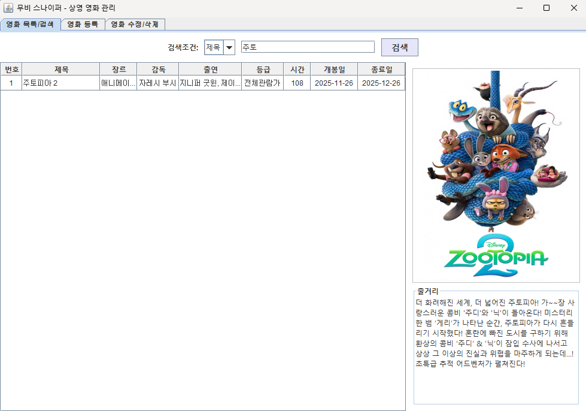
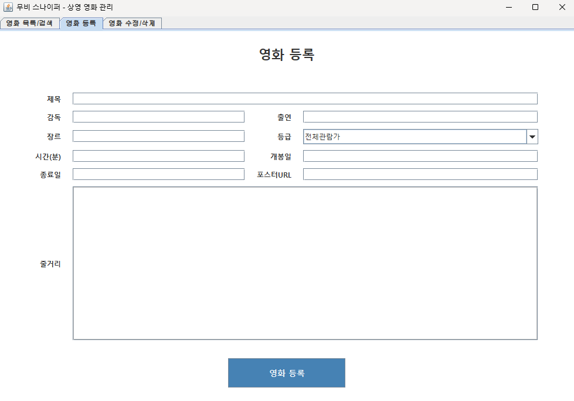
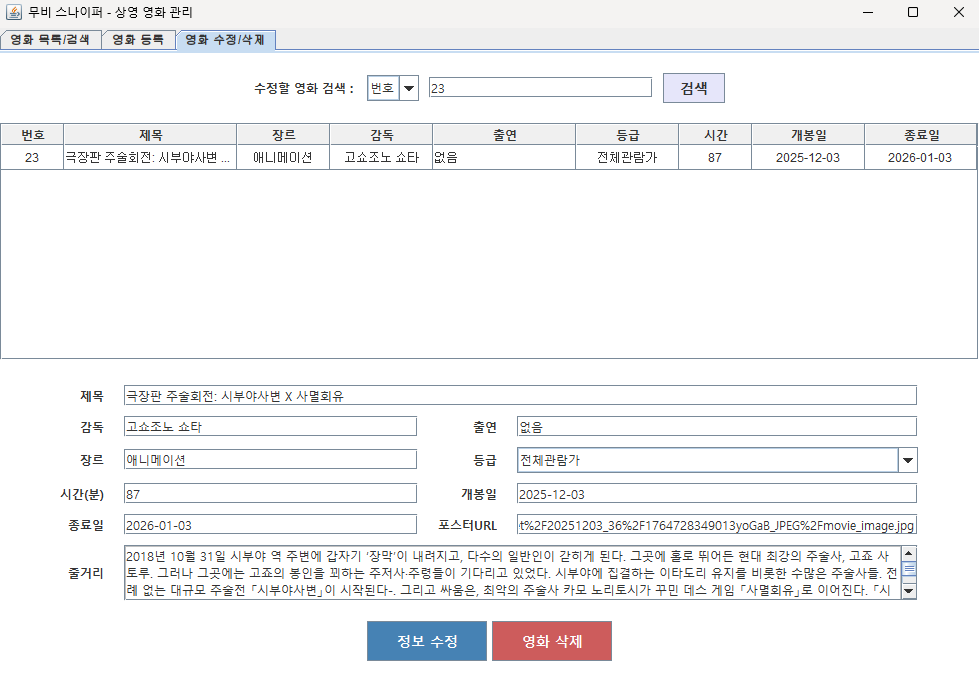

# Movie Sniper — 영화 관리 GUI

Java Swing 화면에서 Oracle DB의 영화 정보를 검색·등록·수정·삭제하는 관리자 프로그램.

수업에서 배운 MVC와 JDBC를 바탕으로 MovieSniper 프로젝트의 일부를 구현했다. 등록·수정 화면의 입력 폼을 공유하고 UI 상수와 JDBC 자원 해제를 별도 클래스로 모았다.



## 화면과 클래스

- `MovieController`가 검색·행 선택·등록·수정·삭제·탭 변경 listener를 연결한다.
- `MovieMainFrame`이 검색, 등록, 수정 탭을 구성한다.
- 등록과 수정은 `MovieFormPanel`을 공유한다. 필수 입력·정수·YYYY-MM-DD 날짜를 검사해 MovieVO를 만든다.
- `MovieRepository`는 검색 대상 컬럼 배열과 PreparedStatement로 조건 검색하고 CRUD를 처리한다.
- `UIConstants`에 글꼴·색상, `JDBC_Connector.close`에 ResultSet·PreparedStatement·Connection 해제를 모았다.




## 실행 조건

기존 개발 기록의 JDK 17·IntelliJ IDEA를 기준으로 프로젝트를 연다. Swing, `java.sql`, Oracle driver를 사용하며 의존성을 받는 Maven/Gradle 파일은 없다.

1. `src`를 source root로 지정하고 Oracle JDBC driver를 IDE classpath에 추가한다. `.idea`의 driver library 경로는 원래 개발 PC 경로이므로 파일 포함 여부를 확인한다.
2. `movie/repository/JDBC_Connector.java`의 Oracle XE URL(`localhost:1521/xe`)과 계정 설정에 맞는 DB를 준비한다. 코드 상수이며 환경변수로 읽지 않는다.
3. 아래 테이블·sequence를 준비한다. `MovieRepository`는 아래 컬럼과 `seq_movie_id`를 사용한다.
4. `movie.controller.MovieController.main`을 실행한다.

DB 연결 실패는 null connection으로 이어질 수 있다. 통합 테스트·DB 초기화 자동화는 없으므로 UI가 표시되는 것과 CRUD 성공을 별도로 확인한다. SQL 오류를 Repository가 출력하는 경로도 있어 UI 완료 메시지만으로 DB 성공을 판정하지 않는다.

## Oracle schema

```sql
-- Movie 영화 테이블
-- 1. 영화 ID 자동 증가를 위한 시퀀스 생성
CREATE SEQUENCE seq_movie_id START WITH 1 INCREMENT BY 1;

-- 2. 영화(Movie) 테이블 생성
CREATE TABLE Movie (
    movie_id      NUMBER(10)      NOT NULL,   -- 영화 고유 번호 (PK)
    title         VARCHAR2(200)   NOT NULL,   -- 영화 제목
    genre         VARCHAR2(100)   NOT NULL,   -- 장르
    runtime       NUMBER(4)       NOT NULL,   -- 상영 시간 (분)
    grade         VARCHAR2(20)    NOT NULL,   -- 관람 등급
    release_date  DATE            NOT NULL,   -- 개봉일
    poster        VARCHAR2(500),              -- 포스터 이미지 URL
    director      VARCHAR2(100),              -- 감독 이름
    cast          VARCHAR2(500),              -- 출연 배우
    end_date      DATE,                       -- 상영 종료일
    synopsis      CLOB,                       -- 줄거리
    CONSTRAINT pk_movie PRIMARY KEY (movie_id)
);
```

## 소스 위치

`src/movie/controller`, `domain`, `repository`, `view`는 각각 이벤트·데이터 객체·쿼리·화면을 맡고 `src/util`은 화면 공통 설정이다. 입력 검증은 View의 공통 폼에서, SQL 실행은 Repository에서 처리한다.
